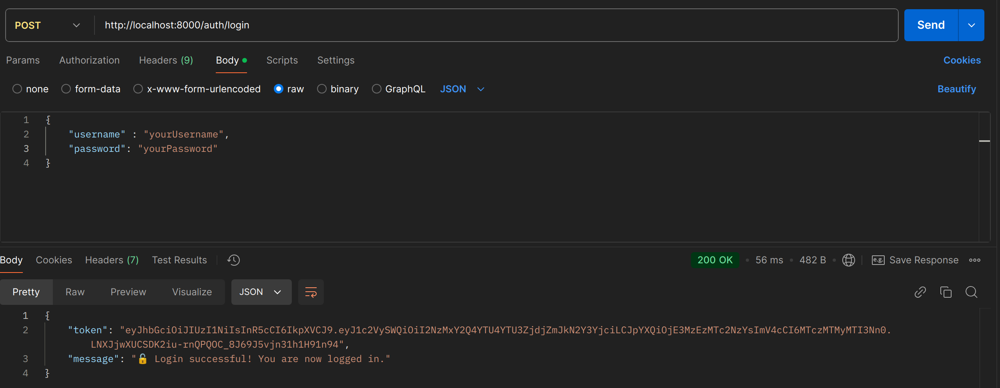
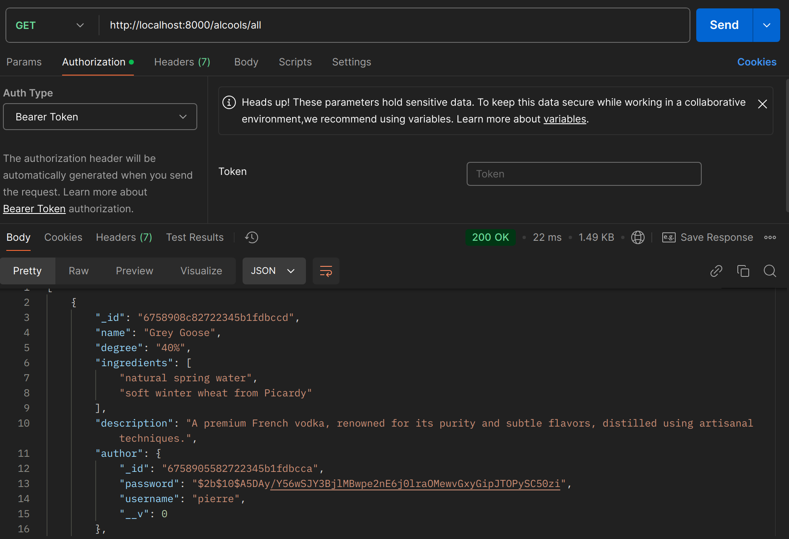
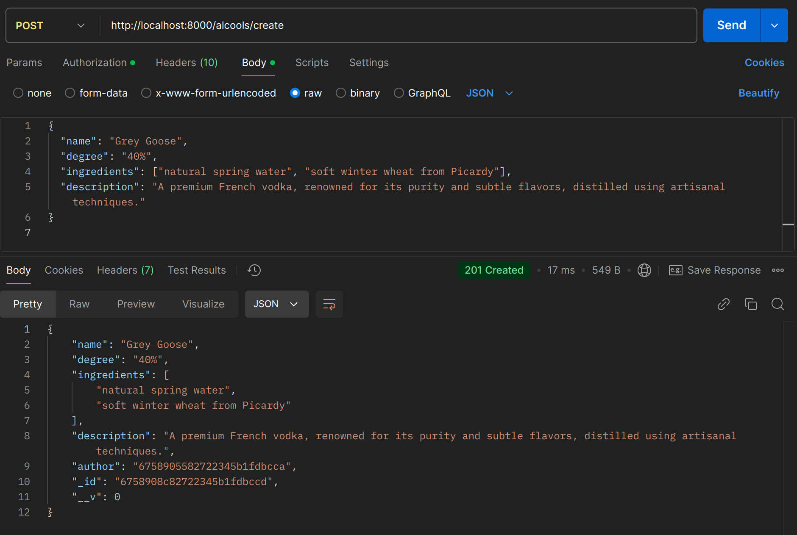

# 🍷 Alcool API Documentation

## 📢 Introduction

The Alcool API allows users to manage a collection of alcoholic beverages, including user authentication and CRUD operations for managing alcohol data.


---

## 🔐 Authentication

To use the API, register an account and then log in to obtain a token for secure access to protected routes.

### Routes Overview

| **Endpoint**      | **Method** | **Description**                  | **Headers**                                | **Body Example**                                                     |
|-------------------|------------|----------------------------------|--------------------------------------------|----------------------------------------------------------------------|
| `/auth/register`  | POST       | Register a new user              | `Content-Type: application/json`           | `{ "username": "yourUsername", "password": "yourPassword" }`         |
| `/auth/login`     | POST       | Log in to obtain an access token | `Content-Type: application/json`           | `{ "username": "yourUsername", "password": "yourPassword" }`         |

### Example Requests

- **Register:**

  

- **Login:**

  

**Note:** Use the returned token in the `Authorization` header for all protected routes.

---

## 🍸 Alcools Routes

The endpoints below allow for managing the alcohol collection. **All routes require an authentication token** in the header.

### Routes Overview

| **Endpoint**          | **Method** | **Description**                              | **Headers**                          | **Body Example**                                                           |
|-----------------------|------------|----------------------------------------------|--------------------------------------|----------------------------------------------------------------------------|
| `/alcools/all`        | GET        | Retrieve a list of all beverages             | `Authorization: Bearer <token>`      | None                                                                       |
| `/alcools/:id`        | GET        | Retrieve details of a specific beverage by ID| `Authorization: Bearer <token>`      | None                                                                       |
| `/alcools/create`     | POST       | Add a new beverage                           | `Authorization: Bearer <token>`      | `{ "name": "AlcoolName", "degree": "45", "ingredients": ["ing1", "ing2"], "description": "A fine drink" }` |
| `/alcools/update/:id` | PUT        | Update a beverage by ID                      | `Authorization: Bearer <token>`      | `{ "name": "UpdatedName", "degree": "50" }`                               |
| `/alcools/delete/:id` | DELETE     | Remove a beverage by ID                      | `Authorization: Bearer <token>`      | None                                                                       |

### Example Requests

- **Get All Alcools:**  
  

- **Get a Specific Alcool:**  
  

- **Create a New Alcool:**  
  

- **Update an Alcool:**  
  

- **Delete an Alcool:**  
  

---

## 🗨️ Comments Routes

### Routes Overview

| **Endpoint**         | **Method** | **Description**               | **Headers**                          | **Body Example**                          |
|----------------------|------------|-------------------------------|--------------------------------------|-------------------------------------------|
| `/comments/:alcoolId`| POST       | Add a comment to an alcool    | `Authorization: Bearer <token>`      | `{ "content": "Great drink!" }`           |
| `/comments/:id`      | PUT        | Update a comment by ID        | `Authorization: Bearer <token>`      | `{ "content": "Updated content." }`       |
| `/comments/:id`      | DELETE     | Remove a comment by ID        | `Authorization: Bearer <token>`      | None                                      |

### Example Requests

- **Add a Comment:**  
  

- **Update a Comment:**  
  

- **Delete a Comment:**  
  

---

## ⚠️ Common Errors

| **Error Code** | **Description**           | **Troubleshooting**                                            |
|----------------|---------------------------|----------------------------------------------------------------|
| 400            | Bad Request               | Ensure valid data and required fields are included in the body. |
| 401            | Unauthorized              | Check if the token is missing or invalid.                       |
| 403            | Forbidden                 | Token may be expired or access is restricted.                   |
| 404            | Not Found                 | The requested resource does not exist.                          |

---

## ⚙️ Dependencies

- **`express`**: To build the API.
- **`mongoose`**: To connect and interact with MongoDB.
- **`nodemon`**: For automatic server restarts during development.

---

## 🎉 Usage

1. **Installation**:
   ```bash
   git clone <repository-url>
   cd alcool-api-b1
   npm install
